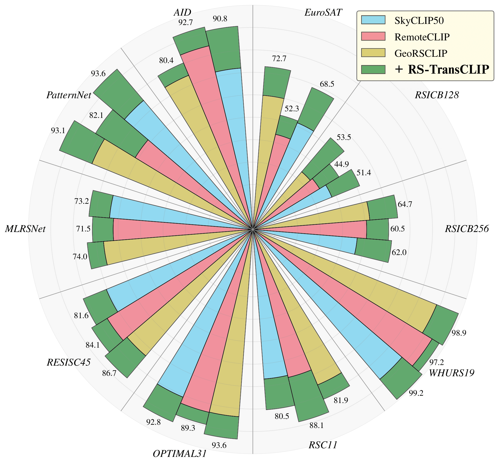
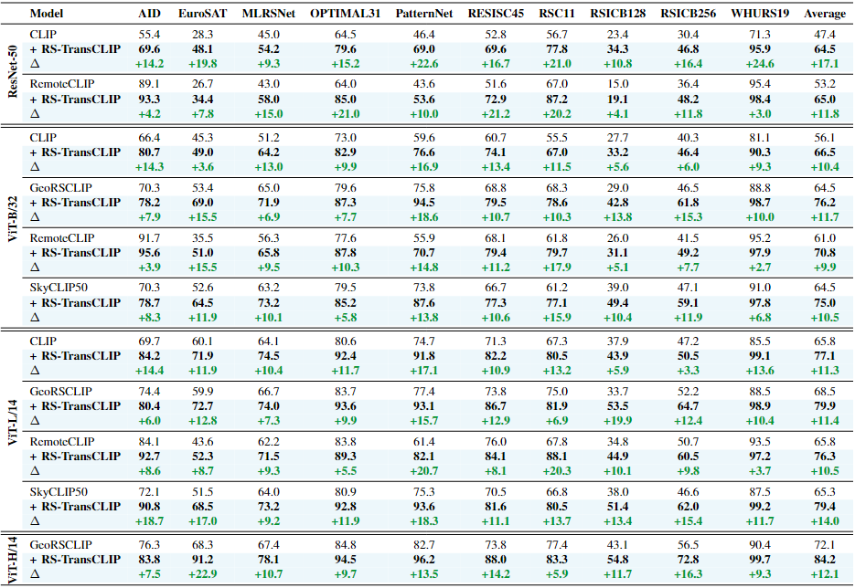

# RS-TransCLIP 🌍🛰️
Welcome to the GitHub repository for [*Enhancing Remote Sensing Vision-Language Models for Zero-Shot Scene Classification*](https://arxiv.org/).

<ins>Authors:</ins>

[K. El Khoury*](https://scholar.google.be/citations?user=UU_keGAAAAAJ&hl=fr), [M. Zanella*](https://scholar.google.com/citations?user=FIoE9YIAAAAJ&hl=fr&oi=ao), [B. Gérin*](https://scholar.google.com/citations?user=MgT_oMAAAAAJ&hl=fr&oi=ao), [T. Godelaine*](https://scholar.google.com/scholar?hl=en&as_sdt=0%2C5&q=Tiffanie+Godelaine&btnG=), [B. Macq](https://scholar.google.be/citations?user=H9pGN70AAAAJ&hl=fr), [S. Mahmoudi](https://scholar.google.com/citations?user=K2BAx8sAAAAJ&hl=en), [C. De Vleeschouwer](https://scholar.google.ca/citations?user=xb3Zc3cAAAAJ&hl=en), [I. Ben Ayed](https://scholar.google.com/citations?user=29vyUccAAAAJ&hl=fr&oi=ao)

*Denotes equal contribution 🫂

<br>

We introduce RS-TransCLIP, a transductive approach inspired from [TransCLIP](https://github.com/MaxZanella/transduction-for-vlms), that enhances Remote Sensing Vison-Language Models <ins>without requiring any labels</ins>, only incurring a negligible computational cost to the overall inference time.

<p align="center">
  
  <br>
  <em>Figure 1: Top-1 accuracy of RS-TransCLIP, on ViT-L/14 Remote Sensing Vision-Language Models, for zero-shot scene classification across 10 benchmark datasets.</em>
</p>


<br><br>
## Contents 📑

- [Setup](#setup-)
- [Datasets](#datasets-️)
- [User Manual](#user-manual-)
- [Citations](#citations-)
- [Contributing](#contributing-)
- [Coming Soon](#coming-soon-)

---
<br><br>
## Setup 🔧

<ins>NB:</ins> the Python version used is 3.10.12.

<br>

Create a virtual environment and activate it:

```bash
# Example using the virtualenv package on linux
python3 -m pip install --user virtualenv
python3 -m virtualenv RS-TransCLIP-venv
source RS-TransCLIP-venv/bin/activate.csh
```

Install Pytorch:
```bash
pip3 install torch==2.2.2 torchaudio==2.2.2 torchvision==0.17.2
```

Clone GitHub and move to the appropriate directory:

```bash
git clone https://github.com/elkhouryk/RS-TransCLIP
cd RS-TransCLIP
```

Install the remaining Python packages requirements:
```bash
pip3 install -r requirements.txt
```

<br>

You are ready to start! 🎉

---
<br><br>
## Datasets 🗂️

10 Remote Sensing Scene Classification datasets are already available for evaluation: 

* The WHURS19 dataset is already uploaded to the repository for reference and can be used directly.
  
* The following 7 datasets (AID, EuroSAT, OPTIMAL31, PatternNet, RESISC45, RSC11, RSICB256) will be automatically downloaded and formatted from Hugging Face using the _run_dataset_download.py_ script.

```bash
# <dataset_name> can take the following values: AID, EuroSAT, OPTIMAL31, PatternNet, RESISC45, RSC11, RSICB256
python3 run_dataset_download.py --dataset_name <dataset_name> 
```

Dataset directory structure should be as follows:
```
$datasets/
└── <dataset_name>/
  └── classes.txt
  └── class_changes.txt
  └── images/
    └── <classname>_<id>.jpg
    └── ...
```

  
* You must download the MLRSNet and RSICB128 datasets manually from Kaggle and place them in '/datasets/' director. You can format them manually to follow the dataset directory structure listed above and use them for evaluation **OR** you can use the _run_dataset_formatting.py_ script.


```bash
# <dataset_name> can take the following values: MLRSNet, RSICB128
python3 run_dataset_formatting.py --dataset_name <dataset_name> 
```

* Download links: [RSICB128](https://www.kaggle.com/datasets/noamaanabdulazeem/myfile) | [MLRSNet](https://www.kaggle.com/datasets/fes2255/mlrsnet) --- <ins>NB:</ins> On the Kaggle website, click on the downlaod **Arrow** in the center of the page instead of the **Download** button to preserve the data structure needed to use the run_dataset_formatting.py_ script (check figure bellow).


<p align="center">
  
  <br>
</p>


<br>


<ins>Notes:</ins>

* The class_changes.txt file inserts a space between combined class names. For example, the class name "railwaystation" becomes "railway station." This change is applied consistently across all datasets.
* The WHURS19 dataset is already uploaded to the repository for reference.


  
---
<br><br>
## User Manual 📘

Running RS-TransCLIP consist of three major steps:

- [Generating Image and Text Embeddings](#generating-image-and-text-embeddings-️)
- [Generating the Average Text Embedding](#generating-the-average-text-embedding-️)
- [Running Transductive Zero-Shot Classification](#running-transductive-zero-shot-classification-️)

We consider 10 scene classification datasets (AID, EuroSAT, MLRSNet, OPTIMAL31, PatternNet, RESISC45, RSC11, RSICB128, RSICB256, WHURS19), 4 VLM models (CLIP, GeoRSCLIP, RemoteCLIP, SkyCLIP50) and 4 model architectures (RN50, ViT-B-32, ViT-L-14, ViT-H-14) for our experiments.

## 

### Generating Image and Text Embeddings 🖼️📄

To generate Image embeddings for each dataset/VLM/architecture trio:

```bash
python3 run_featuregeneration.py --image_fg
```


To generate Text embeddings for each dataset/VLM/architecture trio:

```bash
python3 run_featuregeneration.py --text_fg
```

All results for each dataset/VLM/architecture trio will be stored as follows:

```
$results/
└── <dataset_name>/
  └── <model_name>
    └── <model_architecture>
      └── images.pt
      └── classes.pt
      └── texts_<prompt1>.pt
      └── ....
      └── texts_<prompt106>.pt
```

<ins>Notes:</ins>

* Text embeddings will generate 106 individual text embeddings for each VLM/dataset combination, the exhaustive list of all text prompts can be found in run_featuregeneration.py.
* When generating Image embeddings, the run_featuregeneration.py script will also generate the ground truth labels and store them in "classes.pt". These labels will be used for evaluation.
* Please refer to run_featuregeneration.py to control all the respective arguments.
* The embeddings for the WHURS19 dataset are already uploaded to the repository for reference.


## 

### Generating the Average Text Embedding ⚖️📄

To generate the Average Text embedding each dataset/VLM/architecture trio:
```bash
python3 run_averageprompt.py
```

<ins>Notes:</ins>

* The run_averageprompt.py script will average out all embeddings with the following name structure "texts_*.pt" for each dataset/VLM/architecture trio and create a file called "texts_averageprompt.pt".
* The Average Text embeddings for the WHURS19 dataset are already uploaded to the repository for reference.


## 

### Running Transductive Zero-Shot Classification ⚙️🚀

To run Transductive zero-shot classification using RS-TransCLIP:

```bash
python3 run_TransCLIP.py
```

<ins>Notes:</ins>

* The run_TransCLIP.py script will use the Image embeddings "images.pt", the Average Text embedding "texts_averageprompt.pt" and the class ground truth labels "classes.pt" to run Transductive zero-shot classification using RS-TransCLIP.
* The run_TransCLIP.py script will also generate the Inductive zero-shot classification for performance comparison.
* Both Inductive and Transductive results will be stored in "results/results_averageprompt.csv".
* The results for the WHURS19 dataset are already uploaded to the repository for reference.


<p align="center">
  
  <br>
  <em>Table 1: Top-1 accuracy for zero-shot scene classification without (white) and with (blue) RS-TransCLIP on 10 RS datasets.</em>
</p>


---
<br><br>
## Citations 📚


Support our work by citing our paper if you use this repository: $\color{#f00}{\textsf{TO BE MODIFIED}}$

```
@article{elkhoury2024enhancing,
  title={Enhancing Remote Sensing Vision-Language Models for Zero-Shot Scene Classification},
  author={El Khoury, Karim and Zanella, Maxime and G{\'e}rin, Beno{\^\i}t and Godelaine, Tiffanie and Macq, Beno{\^\i}t and De Vleeschouwer, Christophe and Ben Ayed, Ismail},
  journal={arXiv preprint arXiv},
  year={2024}
}
```

Please also consider citing the original RS-TransCLIP paper:
```
@article{zanella2024boosting,
  title={Boosting Vision-Language Models with Transduction},
  author={Zanella, Maxime and G{\'e}rin, Beno{\^\i}t and Ayed, Ismail Ben},
  journal={arXiv preprint arXiv:2406.01837},
  year={2024}
}
```

For more details on transductive inference in VLMs, visit the TransCLIP comprehensive [repository](https://github.com/MaxZanella/transduction-for-vlms).

---
<br><br>
## Contributing 🤝

Feel free to open an issue or pull request if you have any questions or suggestions.
You can also contact us by [Email](mailto:karim.elkhoury@uclouvain.be).

---
<br><br>
## Coming Soon ⏳

- arXiv preprint
- Automatically downloadable and formatted MLRSNet and RSICB128 datasets
- Text-prompt variability for Zero-Shot Scene Classification
- Few-shot RS-TransCLIP for human-in-the-loop scenarios
